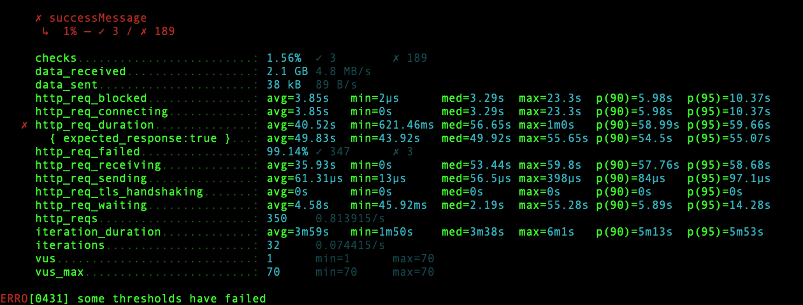
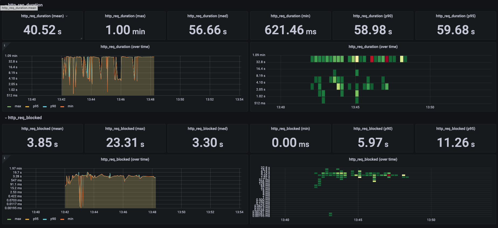
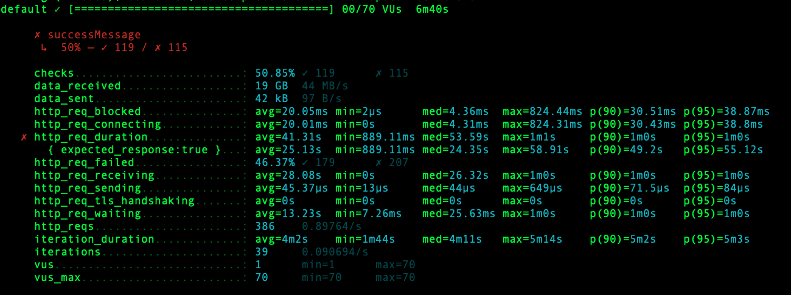
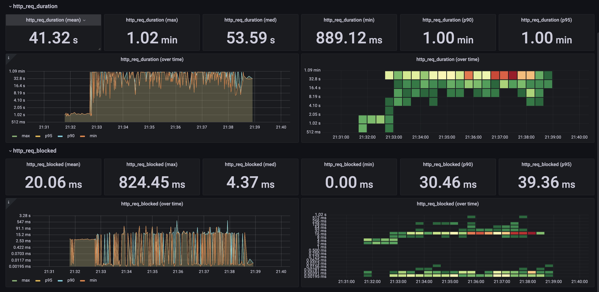

### Influx DB 
docker run -d -p 8086:8086 influxdb:1.8.10

### K6 Test
k6 run --out influxdb=http://localhost:8086/myk6db smoke.js

### Prometheus
docker run -d -p 9090:9090 -v /home/ubuntu/prometheus/prometheus.yml:/etc/prometheus/prometheus.yml prom/prometheus

### graphana
docker run -d --name=grafana -p 3000:3000 grafana/grafana

---
# 1차 테스트 Big Size Image 가져오기

### Test API (k6.testAPI.js:getBigSizeImages)
|  이미지   |  용량  |  
|:------:|:----:|
| 1.jpeg | 44M  | 
| 2.jpeg | 37M  | 
| 3.jpeg | 37M  | 
| 4.jpeg | 230M | 
| 5.jpg  | 106M |  
| 6.jpg  | 27M  | 

### 1차 테스트결과 (튜닝하지않음)

|          파라미터           |   결과값    |                            설명                            |  
|:-----------------------:|:--------:|:--------------------------------------------------------:|
| http_req_duration(mean) | 40.52sec | Request 완료까지 평균 40.52sec 하지만 console을 보면 request가 대부분 실패 |
| http_req_blocked(mean)  | 3.80sec  |                 Requset가 날라가기까지 3.8초가 걸림                 |
|         vusers          |   1~70   |                     70 vuser가 테스트 실행                     |

### 이미지 압축 튜닝 
- 전송시 gzip을 통한 인코딩 

|          파라미터           |  결과값  |                            설명                            |  
|:-----------------------:|:-----:|:--------------------------------------------------------:|
| http_req_duration(mean) | 41sec | Request 완료까지 평균 40.52sec 하지만 console을 보면 request가 대부분 실패 |
| http_req_blocked(mean)  | 20ms  |                 Requset가 날라가기까지 20ms가 걸림                 |
|         vusers          | 1~70  |                     70 vuser가 테스트 실행                     |

- block 시간이 줄었지만 k6 console결과에 request가 모두 실패하여 그런걸로 보인다.