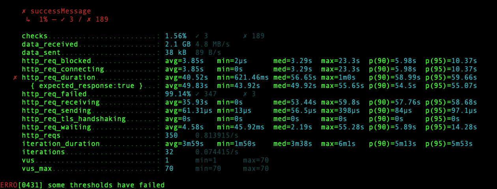
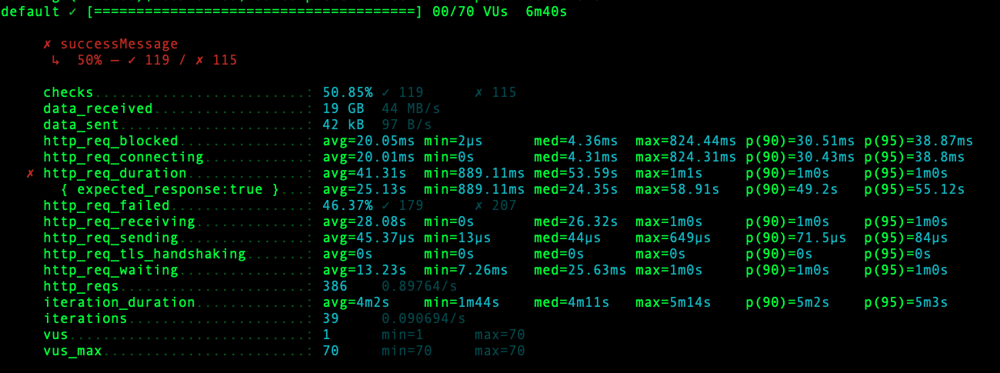
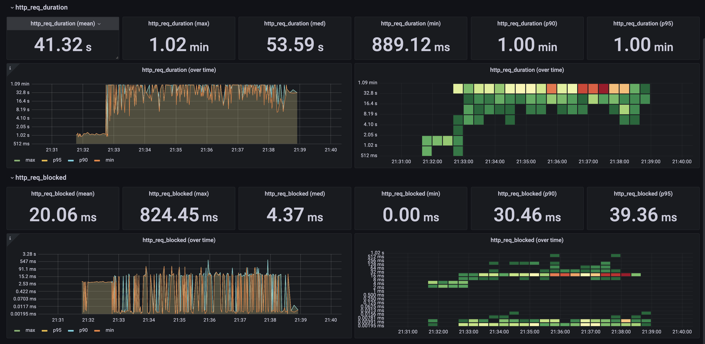

### Influx DB 
docker run -d -p 8086:8086 influxdb:1.8.10

### K6 Test
k6 run --out influxdb=http://localhost:8086/myk6db smoke.js

### Prometheus
docker run -d -p 9090:9090 -v /home/ubuntu/prometheus/prometheus.yml:/etc/prometheus/prometheus.yml prom/prometheus

### graphana
docker run -d --name=grafana -p 3000:3000 grafana/grafana

### redis
docker run -d -p 6379:6379 redis

---
# 1차 테스트 Big Size Image 가져오기

### Test API (k6.testAPI.js:getBigSizeImages)
|  이미지   |  용량  |  
|:------:|:----:|
| 1.jpeg | 44M  | 
| 2.jpeg | 37M  | 
| 3.jpeg | 37M  | 
| 4.jpeg | 230M | 
| 5.jpg  | 106M |  
| 6.jpg  | 27M  | 

### 1차 테스트결과 (튜닝하지않음)

|          파라미터           |   결과값    |                            설명                            |  
|:-----------------------:|:--------:|:--------------------------------------------------------:|
| http_req_duration(mean) | 40.52sec | Request 완료까지 평균 40.52sec 하지만 console을 보면 request가 대부분 실패 |
| http_req_blocked(mean)  | 3.80sec  |                 Requset가 날라가기까지 3.8초가 걸림                 |
|         vusers          |   1~70   |                     70 vuser가 테스트 실행                     |

### 이미지 압축 튜닝 
- 전송시 gzip을 통한 인코딩 

|          파라미터           |  결과값  |                            설명                            |  
|:-----------------------:|:-----:|:--------------------------------------------------------:|
| http_req_duration(mean) | 41sec | Request 완료까지 평균 40.52sec 하지만 console을 보면 request가 대부분 실패 |
| http_req_blocked(mean)  | 20ms  |                 Requset가 날라가기까지 20ms가 걸림                 |
|         vusers          | 1~70  |                     70 vuser가 테스트 실행                     |

- block 시간이 줄었지만 k6 console결과에 request가 모두 실패하여 그런걸로 보인다.

### 서버 Thread 동작 개수 튜닝
- 각 서버들에 대해 actuator로 활성화된 thread 개수, HttpRequest수를 확인하였다.

|          파라미터           |              설명                                    |  
|:-------------------------:|:--------------------------------------------------:|
| HTTP REQUEST COUNT |  vuser에 의해 점진적으로 request가 늘어나고 있다.                   |
| JVM_RUNNABLE_THREADS  | 각 서버에 활성화 가능한 Thread가 8개밖에 존재하지 않는것으로 보인다. |

- 1 차 튜닝 : JVM Thread 개수 설정 (확인해보니 Default 200개이다.)
  - server.tomcat.threads.max : 200(default)
- 2 차 튜닝 : Reverse Proxy 역할을 하는 nginx를 확인해보니 default thread가 8개였다.

### 이미지 캐싱 튜닝 
- 서버에 저장된 이미지가 변경되지 않았다면 Client는 자신이 예전에 받은 이미지를 재사용하게 한다. 

---

# 2차 테스트 DB Bulk Data 가져오기
### 튜닝 전

|             파라미터             |   결과값    |                               설명                               |  
|:----------------------------:|:--------:|:--------------------------------------------------------------:|
|   http_req_duration(mean)    | 13.26sec |                     Request 완료까지 13.26sec                      |
|    http_req_blocked(mean)    |  6.45ms  |                   Requset가 날라가기까지 6.45ms가 걸림                   |
| Panel Title(JDBC Connection) |          | Default로 10개 Connection이 생성되어있고 Query 발생시 Connection을 유동적으로 사용 |

### (튜닝후)지하철 역은 변경이 적은 데이터이기 때문에, 전체 데이터를 Caching하여 불필요한 DB접근을 막는다

|             파라미터             |   결과값    |                                                                설명                                                                 |  
|:----------------------------:|:--------:|:---------------------------------------------------------------------------------------------------------------------------------:|
|   http_req_duration(mean)    | 10.55sec |                                                       Request 완료까지 13.26sec                                                       |
|    http_req_blocked(mean)    |  2.16ms  |                                                    Requset가 날라가기까지 6.45ms가 걸림                                                     |
| Panel Title(JDBC Connection) |          | Default로 10개 Connection이 생성되어있고 최초 Redis Cache Miss일때 DB Connection을 사용하여 데이터 가져온 후, 그 다음부턴 Redis를 통해 데이터를 가져온다. (Connection 미사용) |

